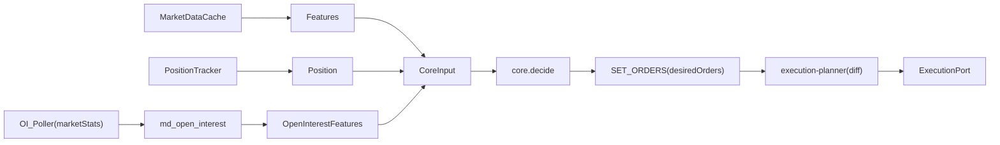

## 背景整理（現状の構造）

- `core` は常に両サイド1本ずつの post-only 指値を出すだけで、サイズは固定USD（`quoteSizeUsd`）です。
- 在庫制御は「線形スキューで両サイドを平行移動」だけで、片約定後に“在庫を減らす側を厚く/増やす側を薄く or 停止”ができません。
- `StrategyMode` は `DEFENSIVE` が存在するものの、価格/サイズに反映されていません（実装が無い）。
- `PAUSE` は `CANCEL_ALL` のみで、在庫が残っても解消（unwind）行動がありません。

該当ファイル:

- `/Users/asumayamada/Private/posaune0423/agentic-mm-bot/packages/core/src/strategy-engine.ts`
- `/Users/asumayamada/Private/posaune0423/agentic-mm-bot/packages/core/src/quote-calculator.ts`
- `/Users/asumayamada/Private/posaune0423/agentic-mm-bot/packages/core/src/risk-policy.ts`
- `/Users/asumayamada/Private/posaune0423/agentic-mm-bot/apps/executor/src/services/execution-planner.ts`

## 目標（KPI/評価軸）

- **片約定の悪影響を小さくする**: 在庫保有後の逆行（例: markout 10s/30s の負側）を縮小。
- **在庫を放置しない**: PAUSE/DEFENSIVEでも在庫縮小の行動が継続される。
- **過剰な取引抑制を避ける**: 約定数/出来高が極端に落ちない（守りに入りすぎない）。

## Factベースの現状診断（直近7日 / extended BTC-USD / docker postgres集計）

以下はDocker上のPostgresに対して `fills_enriched` / `ex_fill` / `ex_order_event` をSQL集計して得た事実（2026-01-21時点）。

### 主要結論（何が起きているか）

- **edge（約定時点のスプレッド由来の稼ぎ）は取れている**が、**価格逆行（adverse selection）が継続的にマイナス**。\n - 10s（VWAP）: `edge_t0_bps_vwap ≈ +1.97bps` に対して `price_move_10s_bps_vwap ≈ -0.48bps`。\n - つまり「取れているedgeが、直後の逆行で削られている」。\n- **60sでは期待値が負**（在庫放置がコストになっている）。\n - 60s（VWAP）: `markout60s_bps_vwap ≈ -2.14bps`、`price_move_60s_bps_vwap ≈ -4.08bps`。\n- **BUY/SELLどちらも逆行が発生**（片側だけの問題ではない）。\n - SELL: edge +1.66bps / price_move10s -0.43bps\n - BUY: edge +2.35bps / price_move10s -0.53bps\n- **DEFENSIVEの方が明確に良い**（守り強化の方向性は正しい）。\n - NORMAL: markout10s ≈ +0.16bps\n - DEFENSIVE: markout10s ≈ +2.93bps\n- **POST_ONLY_REJECTEDが極端に多い**。\n - 直近7日で `POST_ONLY_REJECTED` が約 72k。\n - さらに 1分あたり 2000件級のrejectスパイクが存在。\n

### この事実が意味する実装優先度

- **最優先はUNWIND（reduce-only IOC）**: 60sで負けている以上、在庫を放置しない仕組みが核心。\n- **次にone-sided/攻防一体**: 上下両方で逆行が起きるため、在庫の符号×riskScoreで動的に片側停止/片側厚み。\n- **次にdiffプランナー刷新**: post-only rejectスパイクを抑え、意図した注文が安定して板に残るようにする。\n- **OIはPhase 3として妥当**: ただし現状でも tox/vol/spread だけで十分な差が出ているため、優先度は上記より後。\n

### UNWIND設計の「初期値」をデータから逆算（まずはここを基準に作る）

**目的**: 在庫の平均滞留時間を「損益がひっくり返る前」に短縮する。

- **markoutの時間推移（VWAP / bps）**
  - 1s: `markout1s ≈ +1.79bps`
  - 10s: `markout10s ≈ +1.42bps`
  - 60s: `markout60s ≈ -2.14bps`
  - 10→60が悪化しているため、線形近似では **break-even（損益0）≈ 30秒**。
- **反対サイドで自然に相殺されるまでの時間（素朴近似）**
  - 次の反対サイドfillまで: `P50 ≈ 163s`, `P90 ≈ 770s`
  - 反対サイドが30秒以内に来る割合: **≈ 3.0%**（60秒以内でも ≈ 15%）
  - → 「待っていれば自然に両約定で相殺される」前提は成り立ちにくい。**UNWINDは能動的に必要**。

**推奨するUNWINDの最小実装（シンプル版）**

- **break-evenが約30秒**なので、まずは次を入れるだけで効果が出やすい。\n - **在庫が発生したら即one-sided**（在庫を減らす側だけ quote を残す）\n - **在庫の保有時間が30秒を超えたら、reduce-only IOC を1本だけ追加**（サイズは控えめ、頻度は低めから）\n- 段階設計や細かな割合最適化は、実装後に `fills_enriched` の `markout60s` 改善を見ながら調整する（ここではやり過ぎない）。

## 改善の基本方針（優先度順 / 実装順）

### Phase 0: Intent刷新（B案）— 拡張性の土台を作る

**目的**: one-sided / reduce-only IOC / PAUSE中のunwind / OIレジームなどを自然に表現できる出力にする。

- `core.decide()` は「意図（QUOTE/CANCEL）」ではなく **目標注文集合**を返す
  - `SET_ORDERS` intent（desired ordersの配列）
  - 各orderは `side, price, size, postOnly, reduceOnly, timeInForce, reasonCodes, kind(quote/unwind)` を持つ
- executorは「現状注文」と「desired orders」をdiffし、cancel/place（必要ならreplace）を実行する
  - 既存の [`/Users/asumayamada/Private/posaune0423/agentic-mm-bot/apps/executor/src/services/execution-planner.ts`](/Users/asumayamada/Private/posaune0423/agentic-mm-bot/apps/executor/src/services/execution-planner.ts) を `SET_ORDERS` 基準のdiffプランナーに置き換え/拡張する

### Phase 1: 攻防一体（在庫＋リスク）をSET_ORDERS生成に反映（最短で効く）

**狙い**: 勝てる局面ではタイト＆サイズ増、危険局面では広げ＆縮小＆片側停止＋unwind。

1. **DEFENSIVE/高リスク時は守る（スプレッド拡大・サイズ縮小・片側停止）**

- `riskScore`（tox/vol/markIndexDiv/liqCount + 後でOI）を作り、以下を同時制御
  - half-spread拡大（守り）
  - quote size縮小（守り）
  - 在庫が増える側のquote停止（one-sided）

2. **低リスク時は攻める（タイト化・サイズ増）**

- `riskScore` が低い局面では
  - half-spreadを市場スプレッドに近づける（ただし下限あり）
  - quote sizeを増やす（ただし `maxInventory` 制約は維持）

3. **市場スプレッド（spreadBps）を価格決定に入れる**

- half-spreadの下限を「市場スプレッドの一定割合」＋「安全マージン」に合わせ、最低でも“取れてるedge”が残る設計にする

### Phase 2: 在庫放置をなくす（UNWINDを正式実装）

4. **PAUSE/高リスクでも在庫縮小だけは走らせる（reduce-only IOC）**

- `SET_ORDERS.orders` に `kind=unwind` の注文を混ぜる
  - 片側のみ、reduce-only=true、timeInForce=IOC、サイズ上限・頻度制限を持つ
  - リスクが高いほどunwind強度（サイズ/頻度）を上げる

### Phase 3: OIを「marketStatisticsポーリング → 自前時系列化」でレジーム判定に使う

5. **OIは「危険局面の検知（守りスイッチ）」に使う**

- 取得: `markets/{market}/stats` の `openInterest/openInterestBase`（スナップショット）
- 保存: 新規テーブル `md_open_interest` に定期保存（推奨: 60秒間隔）
- 特徴量: `oiDelta_5m/15m/1h`, `oiShock`, （任意）`oiZ`
- 反映: `riskScore` に加算し、守り（spread/size/one-sided/unwind）を強める

### Phase 4: 口座状態（任意）

6. **“レバを動的に” = 実装上は「リスク予算でサイズを動的に」**

- Extendedの `balance` で `equity/availableForTrade/marginRatio/leverage` が取れるので、executorが取得して `core` に渡す設計へ（今回は在庫上限で運用するため任意）

## 仕様の形（データフロー案）

## データ解析（スプレッド収益が出ているかをDBで可視化）

`fills_enriched` は markout（逆行/順行込みの損益）を持つが、「約定時点でミッドに対して有利に刺さっているか（edge）」は別指標として分解する。

### View A: fill単位の分解（edge vs adverse selection）

- `edge_t0_bps`（BUY: (midT0-fillPx)/midT0*10000, SELL: (fillPx-midT0)/midT0*10000）
- `price_move_10s_bps = markout10sBps - edge_t0_bps`
- `notional_t0 = fillSz * midT0`
- `edge_t0_usd = edge_t0_bps/10000 * notional_t0`
- `markout10s_usd = markout10sBps/10000 * notional_t0`
- feeが取れていれば `edge_net_usd = edge_t0_usd - fee` を併記

### View B: 時間窓集計（hourly/daily）

- `sum(edge_t0_usd)`（スプレッド由来の稼ぎの近似）
- `sum(price_move_10s_usd)`（逆行/順行の影響）
- `sum(markout10s_usd)`（合計）
- `edge_t0_bps_vwap`（notional加重平均）
- `markout10s_bps_vwap`

該当スキーマ:\n- `/Users/asumayamada/Private/posaune0423/agentic-mm-bot/packages/db/src/schema/ex-fill.ts`\n- `/Users/asumayamada/Private/posaune0423/agentic-mm-bot/packages/db/src/schema/fills-enriched.ts`

## 実装の当たりファイル（変更箇所の候補）

- `core`:\n - [`/Users/asumayamada/Private/posaune0423/agentic-mm-bot/packages/core/src/types.ts`](/Users/asumayamada/Private/posaune0423/agentic-mm-bot/packages/core/src/types.ts)\n - [`/Users/asumayamada/Private/posaune0423/agentic-mm-bot/packages/core/src/strategy-engine.ts`](/Users/asumayamada/Private/posaune0423/agentic-mm-bot/packages/core/src/strategy-engine.ts)\n - [`/Users/asumayamada/Private/posaune0423/agentic-mm-bot/packages/core/src/quote-calculator.ts`](/Users/asumayamada/Private/posaune0423/agentic-mm-bot/packages/core/src/quote-calculator.ts)\n - [`/Users/asumayamada/Private/posaune0423/agentic-mm-bot/packages/core/src/risk-policy.ts`](/Users/asumayamada/Private/posaune0423/agentic-mm-bot/packages/core/src/risk-policy.ts)\n- `executor`:\n - [`/Users/asumayamada/Private/posaune0423/agentic-mm-bot/apps/executor/src/usecases/decision-cycle.ts`](/Users/asumayamada/Private/posaune0423/agentic-mm-bot/apps/executor/src/usecases/decision-cycle.ts)\n - [`/Users/asumayamada/Private/posaune0423/agentic-mm-bot/apps/executor/src/services/execution-planner.ts`](/Users/asumayamada/Private/posaune0423/agentic-mm-bot/apps/executor/src/services/execution-planner.ts)\n- `db`:\n - `/Users/asumayamada/Private/posaune0423/agentic-mm-bot/packages/db/src/schema/`（`md_open_interest`追加）\n - `/Users/asumayamada/Private/posaune0423/agentic-mm-bot/packages/db/migrations/`（テーブル/ビュー追加）

## 検証（最小）

- `core` unit testで:\n - 在庫が正/負のときにone-sided/片側厚みが期待通り（SET_ORDERSの中身が変わる）\n - 高リスクでスプレッド拡大/サイズ縮小/UNWINDが混ざる\n- DBビューで:\n - `edge_t0`（スプレッド由来）と `price_move`（逆行）を分解して、悪化の原因を特定できる

## まず着手する推奨順

1. Phase 0（intent刷新SET_ORDERS + planner diff：最小）\n2. UNWIND（reduce-only IOC：シンプル版）\n3. one-sided（在庫増える側を止める）＋簡易DEFENSIVE\n4. rejectスパイク対策（無駄更新の抑制）\n5. スプレッド収益のDBビュー（効果検証）\n6. （後回し）OI時系列化や高度な閾値最適化\n7. （任意）口座状態で動的リスク予算

\*\*\* End of File