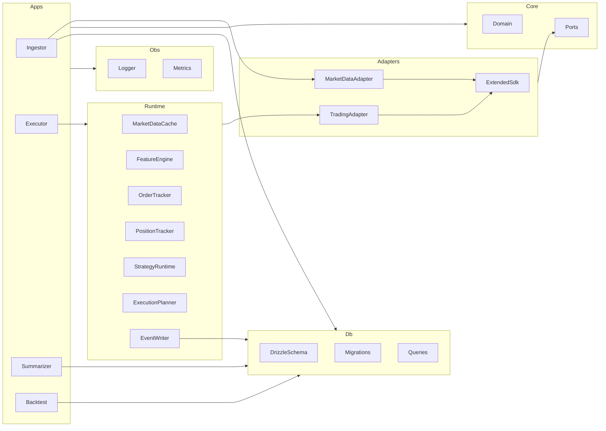
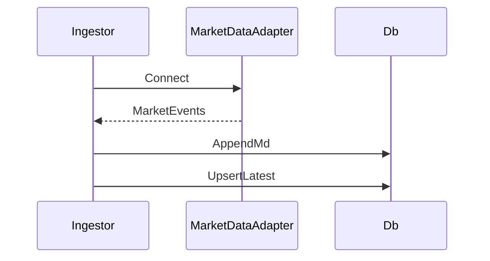
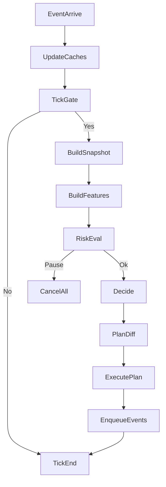
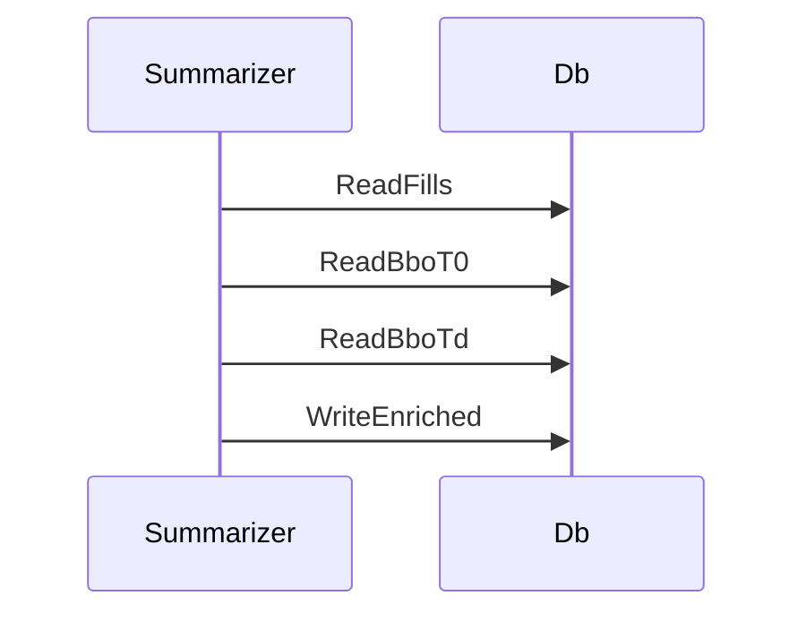

# Design Document

## Overview

本設計は `agentic-mm-bot` のMVPを、要件（`requirements.md`）から解釈ブレなく実装するための技術設計（HOW）を定義する。対象venue(v1)は Extended とし、coreは venue-agnostic（adapter差し替え可能）とする。

本MVPでは **LLMはスコープ外**とし、`apps/llm-reflector` を実装しない。後付けできるように、LLM関連は **Future Extension** に隔離して契約のみ保持する。

### Goals

- core（純粋ロジック）をI/O（DB/HTTP/WS/FS）から完全分離し、テスト容易性と差し替え容易性を担保する（2.1, 2.2, 2.3）
- **Hot path（メモリ/WS）** と **Cold path（DB）** を分離し、executorの意思決定はDB依存にしない（4.6, 4.10）
- executorは **イベント駆動 + スロットリング** でtickを実行し、RiskPolicyを最優先にして PAUSE/cancel_all を確実に実行する（4.9, 4.5, 5.2）
- fills_enriched と markout を **mid参照**で一貫計算し、毒性評価（markout）を監査可能な形で保存する（9.2）
- Extended 連携は **SDK/公式サンプル前提**で adapter に閉じ込め、署名/認証/制約を一箇所に集約する（2.3）

### Non-Goals

- L2 full orderbook、ニュース/SNS、複数取引所同時稼働、高度なqueue推定、RL（PPO/SAC）（1.6）
- LLMワーカー（`apps/llm-reflector`）の実装と運用（Future Extensionへ移動）

## Architecture

### Architecture Pattern & Boundary Map

選択パターンは **Hexagonal（Ports & Adapters）** とする。appsはcomposition rootとしてDIを担い、coreは純粋関数と型で意思決定を表現する。



### Technology Stack & Alignment

| Layer     | Choice                       | Role in Feature    | Notes                                                                                                                               |
| --------- | ---------------------------- | ------------------ | ----------------------------------------------------------------------------------------------------------------------------------- |
| Runtime   | Bun                          | 実行/テスト        | `bun test`                                                                                                                          |
| Language  | TypeScript strict            | 実装               | coreはthrow禁止（1.3）                                                                                                              |
| DB        | Postgres（標準）             | 時系列/監査        | Drizzle schema + indexes（12.2）                                                                                                    |
| ORM       | Drizzle                      | schema SoT         | `packages/db` が唯一の正（1.2）                                                                                                     |
| Errors    | neverthrow                   | Result/ResultAsync | I/OはResultAsync（1.3）                                                                                                             |
| LLM       | Mastra                       | 将来拡張           | Future Extension（10.1–10.6, 13.1–13.4）                                                                                            |
| Venue SDK | Extended TypeScript examples | adapter実装        | env/運用注意の根拠: [Extended TypeScript examples](https://raw.githubusercontent.com/x10xchange/examples/main/typescript/README.md) |

## System Flows

### Ingestor flow



### Executor tick flow（順序固定）



### Summarizer flow（fills_enriched + markout）



## Requirements Traceability

> 要件IDは `requirements.md` の **N.M** を正とする。

| Requirement | Summary                              | Components                                | Interfaces       | Flows      |
| ----------- | ------------------------------------ | ----------------------------------------- | ---------------- | ---------- |
| 1.1–1.5     | 技術前提/SoT/Result/env/MVPスコープ  | all                                       | env, Result      | all        |
| 2.1–2.4     | 境界（core純化/adapter隔離）         | Core, Adapters, Apps                      | Ports            | boundary   |
| 3.1–3.6     | ingestor + md間引き                  | Ingestor, MarketDataAdapter, Db           | MarketDataPort   | Ingestor   |
| 4.1–4.11    | executor（WS中心/非同期永続化/復旧） | Executor, Runtime, Domain, TradingAdapter | ExecutionPort    | Executor   |
| 5.1–5.7     | 状態機械/遷移                        | Domain                                    | ClockPort        | Executor   |
| 6.1–6.6     | 特徴量                               | Domain, Executor                          | MarketDataPort   | Executor   |
| 7.1–7.8     | クォート/更新                        | Domain, Executor                          | ExecutionPort    | Executor   |
| 8.1–8.3     | RiskPolicy                           | Domain                                    | TelemetryPort    | Executor   |
| 9.1–9.6     | summarizer                           | Summarizer, Db                            | AnalyticsStore   | Summarizer |
| 10.1–10.6   | LLM提案/ゲート/監査                  | FutureLlmReflector, Domain, Db, Fs        | ProposalPort     | Future     |
| 11.1–11.4   | backtest                             | Backtest, Domain                          | ExecutionPortSim | Backtest   |
| 12.1–12.4   | DB/Postgres + strategy_state         | Db                                        | migrations       | N/A        |
| 13.1–13.4   | 推論ログ                             | FutureLlmReflector, Fs, Db                | FileSinkPort     | Future     |
| 14.1–14.3.5 | テスト/受入                          | all                                       | N/A              | N/A        |

## Components and Interfaces

### Clean Structure (MVP) — Pure Core + Executor（LLM Workerなし）

MVPでは executor の責務を「read → decide → execute → persist」に集約し、`decisionCycle.ts` が一本道で読める構造を正とする。DBアクセスは repositories、取引所I/Oは gateways に分離し、どちらもDI可能にする（2.1–2.3）。

```
.
├─ apps/
│  └─ executor/
│     └─ src/
│        ├─ main.ts
│        ├─ usecases/
│        │  └─ decisionCycle.ts
│        ├─ services/
│        │  ├─ featureEngine.ts
│        │  ├─ scheduler.ts
│        │  └─ killSwitch.ts
│        ├─ repositories/
│        │  ├─ index.ts
│        │  └─ postgres/
│        │     ├─ snapshotRepository.ts
│        │     ├─ positionRepository.ts
│        │     ├─ stateRepository.ts
│        │     └─ eventRepository.ts
│        ├─ gateways/
│        │  ├─ index.ts
│        │  └─ extended/
│        │     └─ executionGateway.ts
│        └─ __tests__/
│           ├─ unit/
│           └─ integration/
└─ packages/
   ├─ core/
   └─ adapters/
      └─ extended/
```

### packages/core（Pragmatic DDD / Clean Architecture）

#### Domain model（概念と不変条件）

- **Aggregate**: StrategySession（exchange+symbolの意思決定ループ）
  - **Invariants**:
    - PAUSE中はQUOTE intentを生成しない（5.1, 7.5）
    - すべての決定は reasonCodes を返す（監査/学習/テストの共通語彙）
    - 欠損/不明は error ではなく停止推奨として表現可能（6.6, 8.1）
- **Entity**: OpenOrdersState（既存注文の把握）
- **Value objects**: Bps, Ms, Side, Mode, PriceStr, SizeStr（浮動小数を排除）

#### Public contract（core）

```typescript
export type StrategyMode = "NORMAL" | "DEFENSIVE" | "PAUSE";

export type ReasonCode =
  | "DATA_STALE"
  | "MARK_INDEX_DIVERGED"
  | "LIQUIDATION_SPIKE"
  | "INVENTORY_LIMIT"
  | "DEFENSIVE_VOL"
  | "DEFENSIVE_TOX"
  | "POST_ONLY_REJECTED"
  | "PARAM_GATE_REJECTED";

export type OrderIntent =
  | { type: "CANCEL_ALL"; reasonCodes: ReasonCode[] }
  | {
      type: "QUOTE";
      bidPx: string;
      askPx: string;
      size: string;
      postOnly: true;
      reasonCodes: ReasonCode[];
    };

export interface DecideInput {
  nowMs: number;
  mode: StrategyMode;
  features: Features;
  params: StrategyParams;
  position: Position;
}

export interface DecideOutput {
  nextMode: StrategyMode;
  intents: OrderIntent[];
  reasonCodes: ReasonCode[];
}

export interface Snapshot {
  exchange: string;
  symbol: string;
  nowMs: number;
  bestBidPx: string;
  bestAskPx: string;
  markPx?: string;
  indexPx?: string;
  dataStale: boolean;
}

export interface Features {
  midPx: string;
  spreadBps: string;
  tradeImbalance1s: string;
  realizedVol10s: string;
  markIndexDivBps: string;
  liqCount10s: number;
}

export interface Position {
  size: string;
}

export interface StrategyParams {
  baseHalfSpreadBps: string;
  volSpreadGain: string;
  toxSpreadGain: string;
  quoteSizeBase: string;
  refreshIntervalMs: number;
  staleCancelMs: number;
  maxInventory: string;
  inventorySkewGain: string;
  pauseMarkIndexBps: string;
  pauseLiqCount10s: number;
}
```

> 具体の `features` / `params` は `packages/core` で厳密型に落とし込む（any禁止）。上は契約形の例であり、実装詳細ではない。

#### Ports（appsのDI点）

- `MarketDataPort`: 市場データの購読（public stream）と、Snapshot生成用の入力供給
- `AccountPort`: Position取得
- `ParamsPort`: 現行params取得（メモリキャッシュ可）と、変更時の永続化
- `ExecutionPort`: place/cancel/cancel_all/open_orders（private streamが無い場合の同期含む）
- `ClockPort`: 時刻/境界丸め
- `TelemetryPort`: カウンタ/トレース

### apps/executor（Runtime）

> Hot path（メモリ/WS）と Cold path（DB）を分離する（4.6, 4.10）。

#### MarketDataCache

| Field        | Detail                                                                   |
| ------------ | ------------------------------------------------------------------------ |
| Intent       | public market data の最新状態と短期trade履歴を保持し Snapshot 材料を提供 |
| Requirements | 4.1, 4.6, 6.1–6.5                                                        |
| Contracts    | State [x]                                                                |

**Responsibilities & Constraints**

- 最新BBO/mark/indexを保持する
- 直近10秒程度のtradesを保持する（feature計算の入力）

#### FeatureEngine

| Field        | Detail                                  |
| ------------ | --------------------------------------- |
| Intent       | rolling window から Features を生成する |
| Requirements | 4.2, 6.1–6.5                            |
| Contracts    | Service [x]                             |

##### Service Interface

```typescript
interface FeatureEngineService {
  compute(nowMs: number, snapshot: Snapshot): Features;
}
```

#### OrderTracker

| Field        | Detail                                                   |
| ------------ | -------------------------------------------------------- |
| Intent       | active orders をメモリ上で追跡し、plan diff の基準を提供 |
| Requirements | 4.6, 4.7, 4.8, 7.7                                       |
| Contracts    | State [x]                                                |

#### PositionTracker

| Field        | Detail                                                             |
| ------------ | ------------------------------------------------------------------ |
| Intent       | 最新ポジションを保持する（private stream優先、RESTフォールバック） |
| Requirements | 4.6, 4.7, 4.8                                                      |
| Contracts    | State [x]                                                          |

#### StrategyRuntime

| Field        | Detail                                                               |
| ------------ | -------------------------------------------------------------------- |
| Intent       | StrategyState を保持し、core.decide を呼んで mode/intents を更新する |
| Requirements | 5.1–5.7, 4.5                                                         |
| Contracts    | State [x]                                                            |

#### ExecutionPlanner

| Field        | Detail                                                                |
| ------------ | --------------------------------------------------------------------- |
| Intent       | intents と active orders から最小の実行計画（cancel/place）を生成する |
| Requirements | 7.7, 4.9                                                              |
| Contracts    | Service [x]                                                           |

#### EventWriter

| Field        | Detail                                                           |
| ------------ | ---------------------------------------------------------------- |
| Intent       | md/ex/decision を非同期にDBへappendし、hot path をブロックしない |
| Requirements | 4.10, 3.2, 4.4                                                   |
| Contracts    | Batch [x]                                                        |

### packages/db

- `strategy_state` を復旧用スナップショットとして永続化し、数秒〜数十秒間隔で更新可能にする（4.11, 12.4）

### packages/adapters/extended（SDK採用）

#### SDK採用根拠

公式サンプルは `.env.local` に `API_HOST`, `API_KEY`, `STARK_PRIVATE_KEY`, `VAULT_ID` を要求し、TESTNET/MAINNETのキー取得導線と運用注意（MAINNETでの注文/ポジションのキャンセル忘れ）を明記している。  
出典: [Extended TypeScript examples](https://raw.githubusercontent.com/x10xchange/examples/main/typescript/README.md)

#### adapter責務

- MarketDataAdapter: WS購読/再接続/正規化（3.1–3.5）
- TradingAdapter: post-only注文/取消/建玉取得（4.3, 7.5–7.8）
- 制約処理: tick/lot/min notional の丸めと事前検証
- エラー分類: Network, RateLimit, Auth, InvalidOrder, ExchangeDown, Invariant（8.2）

## Data Models

### Physical Data Model

DBのテーブル定義は `requirements.md` の **12.1–12.4** と **Data Model Tables** を正とする。  
物理最適化（index/必要最小限のパーティショニング等）は migrations SQL に閉じ込める（12.3）。

## Error Handling

### Error Strategy

- I/O（DB/WS/REST/FS）は `ResultAsync<T, AppError>` を返す（1.3）
- core/domainは `Result<T, DomainError>` 相当で表現し、throwしない（1.3）
- 欠損/不明は DomainError ではなく RiskDecision（PAUSE推奨）に変換可能（6.6, 8.1）

## Testing Strategy

### Unit Tests（packages/core）

- RiskPolicy: PAUSE/DEFENSIVE/NORMALの遷移と優先順位（5.2）
- QuotePolicy: spread/tox/vol/skewの反映（7.2–7.4）
- Decide: PAUSE時はCANCEL_ALLのみ（7.5）
  - LLMはMVPスコープ外のため ParamGate は Future Extension で検証対象とする

### Integration Tests（packages/db + apps/summarizer）

- migrateが通る（12.3）
- md*\* insert / latest*\* upsert が成立（3.2, 3.3）
- fills_enriched の生成とmarkout計算が成立（9.1–9.3）

## Optional Sections

### Security Considerations

- `STARK_PRIVATE_KEY` は必須secretとして扱い、ログ出力禁止、t3-envで必須化する（1.4）
  - LLMワーカーを導入する場合の追加対策は Future Extension で定義する

### Performance & Scalability

- executorが毎tickでmd_tradeをDBから引く方式は負荷要因になりうる（6.1–6.5）
  - MVPはDBクエリで開始し、必要ならリングバッファへ移行する（設計上許容）

### Future Extension（LLM Worker）

MVPでは `apps/llm-reflector` を省略する。一方で、後日追加しても executor の構造が崩れないよう、以下は契約として保持する：

- `ProposalPort`: `llm_proposal` の生成/取得/ステータス更新（10.1–10.6）
- `FileSinkPort`: reasoning_trace のファイル永続化（失敗時は提案をDBへ保存しない）（13.1）
- `ParamGate`: changes<=2、±10%、運用ゲートの検証（10.2, 10.5）
