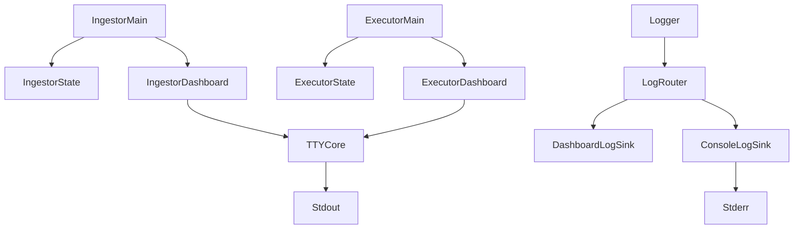
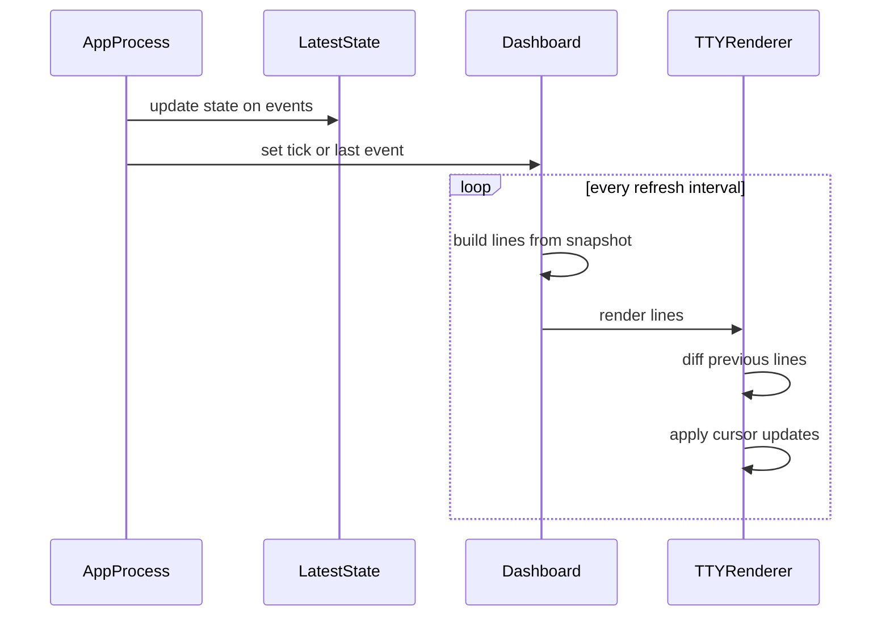
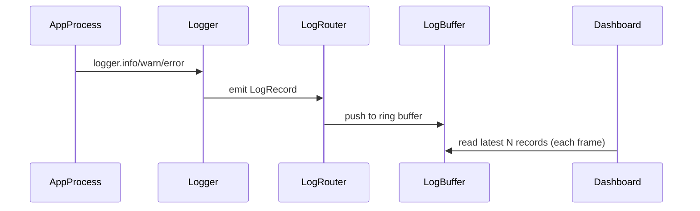

# CLI Dashboard Technical Design

## Overview

本機能は、`apps/ingestor` と `apps/executor` の稼働状態を **端末上の単一画面**で継続的に可視化し、運用担当者が「取得データの鮮度」「現在の戦略モード」「稼働中の注文」「ポジション」「直近のイベント」を即座に把握できるようにする。

既存の `services/cli-dashboard.ts` を拡張し、要件の中核である **滑らかなリアルタイム表示（4.x）** と **ログとの共存（5.x）**、および **色/太字による見やすさ（8.x）** を満たすためのアーキテクチャ、コンポーネント境界、データ契約を定義する。

### Goals

- ingestor / executor の **最新状態**を、安定したレイアウトでリアルタイム表示する（1.3, 2.1-2.6, 3.1-3.6）。
- 画面のちらつきと横揺れを抑え、長時間監視に耐える表示品質を実現する（4.1-4.4, 8.5）。
- 通常ログと競合せず、重要ログは参照可能な形で共存させる（5.1-5.3）。
- 装飾（色/太字）が使えない環境でも破綻しないフォールバックを提供する（4.5, 8.6）。
- bot の意思決定フロー（フェーズ）と重要指標、DEXの最新データ、ログを **同一画面**に統合し、状況把握とトラブルシュートを容易にする（9.1-9.6）。

### Non-Goals

- 履歴の全量閲覧（スクロールバックでの長期ログ閲覧）は対象外（1.3）。
- HTTP UI やWebダッシュボードの提供は対象外。
- 外部TUIフレームワーク（blessed/ink等）の導入は本設計では行わない（依存追加を避ける）。

## Architecture

### Existing Architecture Analysis

- `apps/ingestor` / `apps/executor` は `src/main.ts` が composition root であり、`src/services/cli-dashboard.ts` が TTY UI を提供している。
- 描画は `setInterval` により定期実行され、表示内容はアプリ内メモリの最新値（最後に観測したイベントや tick debug）から組み立てる。
- ログは `packages/utils` の `logger` を利用している。要件(9.5, 9.6)により、ダッシュボード有効時は “抑制” ではなく “取り込み（UI内ログ領域へ集約）” を基本方針とする。

### Architecture Pattern & Boundary Map



**Architecture Integration**:

- Selected pattern: **App-local snapshot + UI renderer**（既存パターンの拡張）。ホットパス（WS受信/意思決定）から描画を分離し、UIは定期的にスナップショットを読むだけにする（4.4）。
- Domain/feature boundaries:
  - アプリ側（ingestor/executor）が **スナップショット生成の責務**を持つ。
  - UI側は **レンダリング（TTY制御、差分描画、装飾）** のみを担当し、I/Oや意思決定ロジックに介入しない。
- Existing patterns preserved: `apps/*`=composition root、`packages/utils`=logger。
- New components rationale: `TTYCore`（差分描画、NO_COLOR、端末復帰）を共通化し、要件(4/8)を横断的に満たすため。
- New components rationale: `LogRouter` により、UI有効時にログをダッシュボードへ取り込み、出力競合を根絶する（5.1, 9.5, 9.6）。
- Steering compliance: core純粋性維持（UIはapps内/周辺）、例外で制御しない、型安全（any禁止）。

### Technology Stack

| Layer                    | Choice / Version             | Role in Feature         | Notes                            |
| ------------------------ | ---------------------------- | ----------------------- | -------------------------------- |
| Frontend / CLI           | Node terminal ANSI           | TTY制御・装飾・差分描画 | 依存追加なし                     |
| Backend / Services       | apps/ingestor, apps/executor | スナップショット生成    | 既存のイベント/ tick から集約    |
| Data / Storage           | none (UI自体は永続化しない)  | 表示のみ                | ログはstderr/既存ログへ          |
| Messaging / Events       | in-process                   | 最新状態/リングバッファ | イベントはUI用に要約保持         |
| Infrastructure / Runtime | Bun + TypeScript             | 実行                    | TTY判定は `process.stdout.isTTY` |

## System Flows

### 定期描画フロー（スナップショット → レンダリング）



**Key decisions**:

- データ更新はイベント駆動、描画は一定周期（4.2）。
- 直前フレームとの差分のみを端末に反映（4.1, 4.3）。

### ログ統合フロー（logger → UI内ログ領域）



**Key decisions**:

- UI有効時はログを “出さない” のではなく “UIに流す”（9.5）。
- ログはリングバッファで保持し、直近N件を表示（9.6）。

## Requirements Traceability

| Requirement | Summary                       | Components                                          | Interfaces       | Flows          |
| ----------- | ----------------------------- | --------------------------------------------------- | ---------------- | -------------- |
| 1.1         | ingestor/executor双方で有効化 | IngestorDashboard, ExecutorDashboard                | DashboardControl | 定期描画フロー |
| 1.2         | (exchange, symbol)単位        | SnapshotModel                                       | SnapshotModel    | 定期描画フロー |
| 1.3         | latest優先                    | SnapshotModel                                       | SnapshotModel    | 定期描画フロー |
| 1.4         | 欠損明示                      | SnapshotModel, Style                                | SnapshotModel    | 定期描画フロー |
| 2.1         | 接続状態と鮮度                | IngestorDashboard, SnapshotModel                    | IngestorSnapshot | 定期描画フロー |
| 2.2         | ストリーム別最終更新          | IngestorDashboard                                   | IngestorSnapshot | 定期描画フロー |
| 2.3         | BBO表示                       | IngestorDashboard                                   | IngestorSnapshot | 定期描画フロー |
| 2.4         | mark/index表示                | IngestorDashboard                                   | IngestorSnapshot | 定期描画フロー |
| 2.5         | レート/間引き状態             | IngestorDashboard                                   | IngestorSnapshot | 定期描画フロー |
| 2.6         | stale強調                     | Style, SnapshotModel                                | Style            | 定期描画フロー |
| 3.1         | modeと理由                    | ExecutorDashboard                                   | ExecutorSnapshot | 定期描画フロー |
| 3.2         | クォート意図                  | ExecutorDashboard                                   | ExecutorSnapshot | 定期描画フロー |
| 3.3         | アクティブ注文                | ExecutorDashboard                                   | ExecutorSnapshot | 定期描画フロー |
| 3.4         | ポジション表示                | ExecutorDashboard                                   | ExecutorSnapshot | 定期描画フロー |
| 3.5         | 直近イベント少数              | EventBuffer                                         | EventBuffer      | 定期描画フロー |
| 3.6         | PAUSE明示                     | Style, ExecutorDashboard                            | Style            | 定期描画フロー |
| 4.1         | 全消去連続を避ける            | TTYRenderer                                         | TTYRenderer      | 定期描画フロー |
| 4.2         | 更新頻度制御                  | DashboardControl                                    | DashboardControl | 定期描画フロー |
| 4.3         | 再描画抑制                    | TTYRenderer                                         | TTYRenderer      | 定期描画フロー |
| 4.4         | ホットパス非ブロック          | SnapshotModel                                       | SnapshotModel    | 定期描画フロー |
| 4.5         | TTYでない場合フォールバック   | DashboardControl                                    | DashboardControl | -              |
| 5.1         | ログ競合回避                  | DashboardControl, Logger                            | -                | -              |
| 5.2         | 重大ログ参照                  | EventBuffer                                         | EventBuffer      | 定期描画フロー |
| 5.3         | 端末状態復帰                  | TTYScreen                                           | TTYScreen        | -              |
| 6.1         | 明示的に有効/無効             | DashboardControl                                    | DashboardControl | -              |
| 6.2         | 安全終了                      | TTYScreen                                           | TTYScreen        | -              |
| 6.3         | 複数シンボル可読性            | LayoutPolicy                                        | LayoutPolicy     | -              |
| 7.1         | 表示モデルをunit test可能     | SnapshotModel, TTYRenderer                          | SnapshotModel    | -              |
| 7.2         | ログ競合の統合検証            | DashboardControl                                    | -                | -              |
| 7.3         | 10分安定表示                  | DashboardControl, TTYRenderer                       | -                | -              |
| 8.1         | 視覚的階層                    | Style, LayoutPolicy                                 | Style            | 定期描画フロー |
| 8.2         | ステータス色分け              | Style                                               | Style            | 定期描画フロー |
| 8.3         | side色+テキスト               | Style                                               | Style            | 定期描画フロー |
| 8.4         | 異常強調                      | Style                                               | Style            | 定期描画フロー |
| 8.5         | 横揺れ抑制                    | LayoutPolicy, TTYRenderer                           | LayoutPolicy     | 定期描画フロー |
| 8.6         | 装飾フォールバック            | Style, DashboardControl                             | Style            | -              |
| 9.1         | executor の処理フェーズ       | FlowStatusTracker, SnapshotModel, ExecutorDashboard | FlowStatus       | 定期描画フロー |
| 9.2         | ingestor の処理フェーズ       | FlowStatusTracker, SnapshotModel, IngestorDashboard | FlowStatus       | 定期描画フロー |
| 9.3         | フェーズ時刻/所要時間         | FlowStatusTracker                                   | FlowStatus       | 定期描画フロー |
| 9.4         | 重要指標の要約表示            | SnapshotModel, ExecutorDashboard, IngestorDashboard | SnapshotModel    | 定期描画フロー |
| 9.5         | ログ取り込み                  | LogRouter, DashboardLogSink, LogBuffer              | LogRecord        | ログ統合フロー |
| 9.6         | ログリングバッファ表示        | LogBuffer, Style                                    | LogRecord        | ログ統合フロー |

## Components and Interfaces

### Summary

| Component         | Domain/Layer | Intent                            | Req Coverage                | Key Dependencies (P0/P1) | Contracts |
| ----------------- | ------------ | --------------------------------- | --------------------------- | ------------------------ | --------- |
| IngestorDashboard | App UI       | ingestor の表示行生成             | 1.1, 2.1-2.6, 4.2, 8.1-8.6  | TTYCore (P0)             | State     |
| ExecutorDashboard | App UI       | executor の表示行生成             | 1.1, 3.1-3.6, 4.2, 8.1-8.6  | TTYCore (P0)             | State     |
| SnapshotModel     | App UI       | 最新状態スナップショットの型/変換 | 1.2-1.4, 2.x, 3.x, 4.4, 7.1 | -                        | State     |
| EventBuffer       | App UI       | 直近イベントのリングバッファ      | 3.5, 5.2                    | -                        | State     |
| TTYScreen         | TTYCore      | alt screen / cursor / restore     | 5.3, 6.2                    | stdout (P0)              | Service   |
| TTYRenderer       | TTYCore      | 差分描画エンジン                  | 4.1-4.3, 8.5                | stdout (P0)              | Service   |
| Style             | TTYCore      | 色/太字/NO_COLOR制御              | 8.1-8.4, 8.6                | env (P1)                 | Service   |
| DashboardControl  | App UI       | enable判定/更新周期設定           | 4.2, 4.5, 5.1, 6.1          | env (P0)                 | Service   |
| LayoutPolicy      | App UI       | 列幅固定/桁揃えルール             | 8.5, 6.3                    | -                        | Service   |
| FlowStatusTracker | App UI       | 現在フェーズと経過時間を追跡      | 9.1-9.3                     | -                        | State     |
| LogRouter         | TTYCore      | ログ出力先を切替（UI/console）    | 5.1, 9.5                    | logger (P0)              | Service   |
| LogBuffer         | App UI       | ログのリングバッファ              | 9.6                         | -                        | State     |

### TTYCore

#### TTYScreen

| Field             | Detail                                           |
| ----------------- | ------------------------------------------------ |
| Intent            | 端末の alternate screen 入退場と復帰を安全に扱う |
| Requirements      | 5.3, 6.2                                         |
| Owner / Reviewers | -                                                |

**Responsibilities & Constraints**

- alternate screen on/off、cursor hide/show を管理する
- SIGINT/SIGTERM/exit で必ず復帰する（多重呼び出し安全）
- UI有効時のみ stdout に制御シーケンスを出す（TTY判定）

**Dependencies**

- Outbound: `process.stdout` — ANSI制御出力（P0）
- Inbound: Dashboard — start/stop 呼び出し（P0）

**Contracts**: Service [x] / API [ ] / Event [ ] / Batch [ ] / State [ ]

##### Service Interface

```typescript
interface TTYScreenService {
  start(): void;
  stop(): void;
  isEnabled(): boolean;
}
```

- Preconditions: stdout が TTY である、かつダッシュボードが有効
- Postconditions: start 後は alternate screen + cursor hidden、stop 後は復帰済み
- Invariants: stop は何度呼んでも端末を壊さない

#### TTYRenderer

| Field             | Detail                                 |
| ----------------- | -------------------------------------- |
| Intent            | 前フレームとの差分だけを端末に適用する |
| Requirements      | 4.1-4.3, 8.5                           |
| Owner / Reviewers | -                                      |

**Responsibilities & Constraints**

- `render(lines)` を受け、前回描画した行配列と比較して **変更行のみ更新**する
- 行数・列幅が増減しても横揺れしにくいよう、`LayoutPolicy` に基づき整形された行を前提にする
- 端末互換性のため、制御は最小セット（cursor move / erase line / write）に限定する

**Dependencies**

- Outbound: `process.stdout` — 行更新の出力（P0）
- Inbound: Dashboard — 行配列の供給（P0）

**Contracts**: Service [x] / API [ ] / Event [ ] / Batch [ ] / State [ ]

##### Service Interface

```typescript
type RenderFrame = ReadonlyArray<string>;

interface TTYRendererService {
  render(frame: RenderFrame): void;
  reset(): void;
}
```

- Preconditions: `frame` の各行は末尾改行を含まない
- Postconditions: 端末表示は `frame` と一致する
- Invariants: `render` は同一 `frame` に対して冪等

#### Style

| Field             | Detail                                                     |
| ----------------- | ---------------------------------------------------------- |
| Intent            | 色/太字/薄色などの装飾を一元管理し、NO_COLOR等で無効化する |
| Requirements      | 8.1-8.4, 8.6                                               |
| Owner / Reviewers | -                                                          |

**Responsibilities & Constraints**

- `NO_COLOR` が設定されている場合、すべての ANSI 装飾を無効化する
- 色だけに依存せず、ラベル（BUY/SELL、status文字列）で判別可能にする（8.3）

**Dependencies**

- Outbound: `process.env` — `NO_COLOR`, `TERM`（P1）

**Contracts**: Service [x] / API [ ] / Event [ ] / Batch [ ] / State [ ]

##### Service Interface

```typescript
type StyleToken = "reset" | "dim" | "bold" | "red" | "yellow" | "green" | "cyan";

interface StyleService {
  enabled(): boolean;
  token(t: StyleToken): string;
}
```

### App UI

#### SnapshotModel

| Field             | Detail                                                         |
| ----------------- | -------------------------------------------------------------- |
| Intent            | ダッシュボードが参照する “最新状態” の型と、欠損表現を固定する |
| Requirements      | 1.2-1.4, 2.1-2.6, 3.1-3.6, 4.4, 7.1                            |
| Owner / Reviewers | -                                                              |

**Responsibilities & Constraints**

- ingestor/executor の表示対象データを “最新状態スナップショット” として明確化する
- 欠損は `null`/`undefined` を明確に扱い、UIは `-`/`N_A` 等の表現に落とす

**Contracts**: State [x]

##### State Model

```typescript
type ConnectionStatus = "connecting" | "connected" | "reconnecting" | "disconnected";

type ExecutorPhase = "IDLE" | "READ" | "DECIDE" | "PLAN" | "EXECUTE" | "PERSIST";
type IngestorPhase = "IDLE" | "CONNECTING" | "SUBSCRIBED" | "RECEIVING" | "FLUSHING";

type PhaseStatus<TPhase extends string> = {
  phase: TPhase;
  sinceMs: number;
  lastTransitionMs: number;
  lastDurationMs?: number;
};

type CommonHeader = {
  exchange: string;
  symbol: string;
  nowMs: number;
  uptimeMs: number;
  tty: boolean;
  connection: { status: ConnectionStatus; reason?: string };
};

type IngestorSnapshot = CommonHeader & {
  flow: PhaseStatus<IngestorPhase>;
  lastBboTs?: number;
  lastTradeTs?: number;
  lastPriceTs?: number;
  lastFundingTs?: number;
  bbo?: { bidPx: string; bidSz: string; askPx: string; askSz: string; midPx: string; spreadBps?: string };
  price?: { markPx?: string; indexPx?: string };
  metrics: {
    bboReceived: number;
    bboWritten: number;
    tradeReceived: number;
    priceReceived: number;
    fundingReceived: number;
    bboBufferSize: number;
    tradeBufferSize: number;
    priceBufferSize: number;
    deadLetterSize?: number;
  };
};

type ExecutorSnapshot = CommonHeader & {
  flow: PhaseStatus<ExecutorPhase>;
  strategy: { mode: "NORMAL" | "DEFENSIVE" | "PAUSE"; reasons: string[]; intents: string[]; pauseRemainMs?: number };
  market: {
    bestBidPx: string;
    bestBidSz: string;
    bestAskPx: string;
    bestAskSz: string;
    markPx?: string;
    indexPx?: string;
    lastUpdateMs?: number;
  };
  position: { size: string; entryPrice?: string; unrealizedPnl?: string; lastUpdateMs?: number };
  targetQuote?: { bidPx: string; askPx: string; size: string };
  orders: ReadonlyArray<{
    side: "buy" | "sell";
    price: string;
    size: string;
    filledSize: string;
    createdAtMs: number;
    clientOrderId: string;
  }>;
};
```

#### DashboardControl

| Field             | Detail                                                      |
| ----------------- | ----------------------------------------------------------- |
| Intent            | 有効化判定と更新周期を統一し、TTYでない場合は自動無効化する |
| Requirements      | 4.2, 4.5, 5.1, 6.1                                          |
| Owner / Reviewers | -                                                           |

**Responsibilities & Constraints**

- `process.stdout.isTTY` が false の場合は UI を無効化（4.5）
- リフレッシュ周期（例: 250ms）を設定可能にし、描画スロットリングの基準とする（4.2）
- UI有効時は ログを DashboardLogSink にルーティングし、stdout 競合を防止する（5.1, 9.5）

**Contracts**: Service [x]

##### Service Interface

```typescript
type DashboardConfig = {
  enabled: boolean;
  refreshMs: number;
  noColor: boolean;
};

interface DashboardControlService {
  config(): DashboardConfig;
}
```

#### EventBuffer

| Field             | Detail                                           |
| ----------------- | ------------------------------------------------ |
| Intent            | 直近イベントを少数保持し、重要度に応じて表示する |
| Requirements      | 3.5, 5.2                                         |
| Owner / Reviewers | -                                                |

**Responsibilities & Constraints**

- INFO/WARN/ERROR のリングバッファを保持し、最新N件を表示する
- UI有効時に取り込まれたエラーを見える化する（stderrの完全取り込みは必須ではない）

#### FlowStatusTracker

| Field             | Detail                                                                       |
| ----------------- | ---------------------------------------------------------------------------- |
| Intent            | アプリの現在フェーズと遷移時刻/所要時間を追跡し、stuck/quietを判別可能にする |
| Requirements      | 9.1-9.3                                                                      |
| Owner / Reviewers | -                                                                            |

**Responsibilities & Constraints**

- アプリ側の処理点で `enterPhase()` を呼び、現在フェーズと遷移情報を保持する
- フェーズ更新はホットパスをブロックしない（単純なメモリ更新）

**Contracts**: State [x]

##### State Management

```typescript
interface FlowStatusState<TPhase extends string> {
  enterPhase(phase: TPhase, nowMs: number): void;
  snapshot(): { phase: TPhase; sinceMs: number; lastTransitionMs: number; lastDurationMs?: number };
}
```

#### LogRouter

| Field             | Detail                                                                    |
| ----------------- | ------------------------------------------------------------------------- |
| Intent            | logger の出力先を “console” と “dashboard” で切替し、UIとログの衝突を防ぐ |
| Requirements      | 5.1, 9.5                                                                  |
| Owner / Reviewers | -                                                                         |

**Responsibilities & Constraints**

- UI有効時は `LogRecord` を DashboardLogSink に送る（stdoutへの直接出力を避ける）
- UI無効時は従来どおり console（stderr/stdout）へ出力する

**Contracts**: Service [x] / State [ ] / Event [ ]

##### Service Interface

```typescript
type LogLevel = "DEBUG" | "INFO" | "WARN" | "ERROR" | "LOG";

type LogRecord = {
  tsMs: number;
  level: LogLevel;
  message: string;
  fields?: Record<string, string>;
};

interface LogSink {
  write(record: LogRecord): void;
}

interface LogRouterService {
  setSink(sink: LogSink): void;
}
```

#### LogBuffer

| Field             | Detail                                   |
| ----------------- | ---------------------------------------- |
| Intent            | UI表示用にログをリングバッファで保持する |
| Requirements      | 9.6                                      |
| Owner / Reviewers | -                                        |

**Responsibilities & Constraints**

- 最新N件を保持し、レベル別に色/太字で強調して表示する（NO_COLOR時はテキストで判別可能）

**Contracts**: State [x]

##### State Management

```typescript
interface LogBufferState {
  push(r: LogRecord): void;
  latest(max: number): ReadonlyArray<LogRecord>;
}
```

**Contracts**: State [x]

##### State Management

```typescript
type EventLevel = "INFO" | "WARN" | "ERROR";
type DashboardEvent = { tsMs: number; level: EventLevel; message: string };

interface EventBufferState {
  push(e: DashboardEvent): void;
  latest(max: number): ReadonlyArray<DashboardEvent>;
}
```

#### LayoutPolicy

| Field             | Detail                           |
| ----------------- | -------------------------------- |
| Intent            | 桁揃えと列幅固定で横揺れを抑える |
| Requirements      | 8.5, 6.3                         |
| Owner / Reviewers | -                                |

**Responsibilities & Constraints**

- 数値の小数桁、単位、固定幅カラムを統一する（8.5）
- 複数シンボル対応時は、一覧表（固定幅）かページングのどちらかに寄せる（6.3）

**Contracts**: Service [x]

##### Service Interface

```typescript
interface LayoutPolicyService {
  padRight(text: string, width: number): string;
  formatAgeMs(nowMs: number, tsMs?: number): string;
}
```

## Data Models

本機能は表示専用であり、新規の永続化データモデルを導入しない。表示対象は既存のメモリ上の最新値（ingestor: last events + metrics、executor: TickDebug + tracker状態）から `SnapshotModel` に射影される。

## Error Handling

### Error Strategy

- ダッシュボードは “観測” であり、表示不能はアプリ本体の停止理由にならない。TTY制御に失敗した場合は UI を無効化し、通常ログへフォールバックする（4.5）。
- UIが有効な場合でも、致命エラーは stderr に残す（logger.error）。

### Monitoring

- 表示上の `stale` 判定は、スナップショットの時刻差（age）に基づき `Style` が強調表示する（2.6, 8.4）。

## Testing Strategy

- Unit Tests:
  - `SnapshotModel` 変換（欠損時の表現、1.4）
  - `LayoutPolicy` の桁揃え/固定幅（8.5）
  - `TTYRenderer` の差分適用（同一フレームは無出力、4.3）
- Integration Tests:
  - “ダッシュボード有効時は stdout をUIが専有し、ログはUI内に取り込まれて出力衝突しない” こと（5.1, 9.5）
  - TTYでない場合に自動無効化されること（4.5）
- Performance/Load:
  - refresh 250ms〜1000msで CPU 使用率が過度に増えないこと（4.2）
