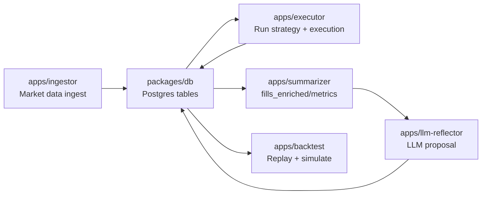

# 構造 / 依存関係（Steering）

このリポジトリは **apps（実行単位）** と **packages（共有ライブラリ）** に分かれます。基本方針は「`core` を純粋に保ち、I/O は周辺へ押し出す」です。

## ディレクトリ構成（パターン）

- **`apps/*`**: 実行プロセス（CLI/常駐）
  - `src/main.ts`: composition root（env/DB/adapter/repository を組み立てる）
  - `src/env.ts`: 環境変数の定義とバリデーション
  - `src/services/*`: 状態やキャッシュ等のアプリ内コンポーネント（例: tracker/cache）
  - `src/usecases/*`: 1回の処理単位のオーケストレーション（Read → Decide → Execute）
  - `src/repositories/interfaces/*`: app 内で必要な永続化の契約
  - `src/repositories/postgres/*`: Postgres/Drizzle 実装
- **`packages/*`**: 共有ライブラリ
  - `packages/core`: 戦略の純ロジック（意思決定・特徴量・リスク・パラメータゲート）
  - `packages/adapters`: 取引所/データソースの adapter と port インターフェース
  - `packages/db`: Drizzle schema（DB の Single Source of Truth）
  - `packages/utils`: logger 等の横断ユーティリティ
  - `packages/*-config`: eslint/prettier/tsconfig の共有設定

## 依存方向（Golden Rule）

- `apps/*` → `packages/*` は依存してよい
- **`packages/core` は他の packages（db/adapters/utils）に依存しない**
- `packages/db` は schema 定義に集中し、アプリのユースケースは持たない
- `packages/adapters` は **port（インターフェース）** と **実装（例: extended）** を分離する

## 実行時データフロー（概念図）



## DBスキーマ運用（パターン）

`packages/db` の方針:

- 主要テーブルは **`(exchange, symbol)`** を持つ
- 時刻カラムは **`ts`**（UTCの timestamptz）
- **Market Data は append**（`md_*`）
- **Latest は upsert**（`latest_*`）
- 実行イベントは `ex_*`、分析系は `fills_enriched`、設定/状態は `strategy_*`、提案系は `llm_*` / `param_rollout`

## Executor の内部構造（パターン）

- **Read**: `MarketDataCache` から snapshot / rolling window を構築
- **Decide**: `packages/core` の `computeFeatures` → `decide`
- **Execute**: intent を plan に落とし `ExecutionPort` へ（post-only maker 前提）
- **Persist**:
  - イベント（fill/order_update）をバッファして定期 flush（非同期・ノンブロッキング）
  - state を定期保存し、再起動時に復元

## ドリフト（検知したもの）

- README / `docker-compose.yaml` に `apps/server` が登場する場合がありますが、現コードの中心は `apps/{executor,ingestor,summarizer,llm-reflector,backtest}` です。追加のHTTPサーバを前提にする場合は、別途 `structure.md` を更新してください。

---

## 旧内容（Legacy / 参考）

以下は過去のテンプレート/別プロダクト想定の記述が残っている可能性があります。**現行の Source of Truth はこのファイル上部**（「構造 / 依存関係（Steering）」以降）です。

# Structure Steering

> **Last Updated**: 2025-12-30  
> **Changes**: Updated repository structure to reflect actual implementation (interfaces/, postgres/, memory/ subdirectories)

## Architecture Pattern

**Layered DDD Architecture** with strict dependency direction:

```
routes → usecases → repositories → domain
         ↓
      repositories/{provider} (implements interfaces)
```

### Layer Responsibilities

- **routes/**: HTTP endpoints, request/response handling, input parsing
- **usecases/**: Business logic orchestration, coordinates repositories
- **repositories/interfaces/**: Data access interfaces (contracts)
- **repositories/{provider}/**: Infrastructure implementations (postgres, memory)
- **domain/**: Core business logic, value objects, entities, shared errors
- **types/**: Shared type definitions (HTTP errors, etc.)
- **utils/**: Utility functions (error handling, etc.)

### Dependency Rules

- Domain layer must NOT import from routes, usecases, or repository implementations
- Routes should use usecases, not domain directly (soft rule)
- Usecases depend on repository interfaces, not implementations
- Repository implementations (postgres, memory) implement repository interfaces
- Utils and types are shared across layers

## Directory Organization

### Application Structure (`apps/server/src/`)

```
src/
├── app.ts              # Application assembly, route mounting
├── server.ts           # Server entry point
├── routes/             # HTTP route handlers
│   ├── index.ts        # Route aggregation
│   ├── health.ts       # Health check endpoint
│   └── {resource}.ts   # Resource-specific routes
├── usecases/           # Business logic usecases
│   └── {action}-{resource}/
│       ├── index.ts    # Public exports
│       ├── input.ts    # Input validation schema
│       └── usecase.ts  # Usecase implementation
├── repositories/       # Repository layer
│   ├── interfaces/     # Repository interfaces (contracts)
│   │   ├── index.ts
│   │   └── {resource}-repository.ts
│   ├── postgres/       # PostgreSQL implementations
│   │   ├── db.ts       # Database connection
│   │   ├── index.ts
│   │   └── {resource}-repository.ts
│   └── memory/         # In-memory implementations (for testing)
│       ├── index.ts
│       └── {resource}-repository.ts
├── domain/             # Domain layer
│   ├── index.ts
│   └── errors.ts       # Domain error types
├── types/              # Shared type definitions
│   └── http-error.ts   # HTTP error types
└── utils/              # Utility functions
    └── http-error.ts   # Error handling utilities
```

### Package Structure (`packages/`)

- **db/**: Database schema definitions, Drizzle config
- **eslint-config/**: Shared ESLint configurations
- **prettier-config/**: Shared Prettier configuration
- **typescript-config/**: Shared TypeScript configurations
- **utils/**: Shared utilities (logger, etc.)

## Naming Conventions

### Files & Directories

- **Routes**: `{resource}.ts` (e.g., `posts.ts`, `users.ts`)
- **Usecases**: `{action}-{resource}/` directory (e.g., `create-post/`)
- **Repository Interfaces**: `interfaces/{resource}-repository.ts` (e.g., `interfaces/post-repository.ts`)
- **Repository Implementations**: `{provider}/{resource}-repository.ts` (e.g., `postgres/post-repository.ts`, `memory/post-repository.ts`)

### Functions & Types

- **Usecase execution**: `execute{Action}{Resource}` (e.g., `executeCreatePost`)
- **Input parsing**: `parse{Action}{Resource}Input` (e.g., `parseCreatePostInput`)
- **Factory functions**: `create{Thing}` (e.g., `createPostgresPostRepository`)
- **Error factories**: `{errorType}Error` (e.g., `notFoundError`, `validationError`)
- **Interfaces**: PascalCase (e.g., `PostRepository`, `CreatePostInput`)
- **Types**: PascalCase (e.g., `PostRepositoryError`, `DomainError`)

### Exports

- Each usecase directory has `index.ts` for public API
- Repository interfaces exported from `repositories/`
- Domain types exported from `domain/shared/`

## Import Patterns

### Import Order

1. External dependencies (hono, neverthrow, zod, etc.)
2. Workspace packages (`@agentic-mm-bot/*`)
3. Relative imports (same layer or parent layers)

### Import Style

- Use type imports for interfaces/types: `import type { PostRepository }`
- Use value imports for functions/classes: `import { executeCreatePost }`
- Group imports with blank lines between groups

### Layer Boundaries

- Routes import from usecases, repository interfaces (for DI), and utils
- Usecases import from repository interfaces and domain
- Repository interfaces import from domain (for error types)
- Repository implementations import from interfaces and domain
- Utils and types are shared across layers

## Code Organization Patterns

### Usecase Pattern

Each usecase follows this structure:

- `input.ts`: Zod schema + `parse{Action}{Resource}Input` function
- `usecase.ts`: `execute{Action}{Resource}` function with `{Action}{Resource}Deps` interface
- `index.ts`: Re-exports public API

### Repository Pattern

- Interface defined in `repositories/interfaces/{resource}-repository.ts`
- Implementation in `repositories/{provider}/{resource}-repository.ts`
- Factory function: `create{Provider}{Resource}Repository`
- Multiple implementations supported (postgres for production, memory for testing)

### Error Handling Pattern

- Domain errors use discriminated unions (`type` field)
- Factory functions return error objects (no throwing)
- Usecases return `Result<T, E>` with domain errors
- Routes convert domain errors to HTTP responses

### Dependency Injection Pattern

- Dependencies passed as function parameters
- Interface-based dependencies (not concrete classes)
- Factory functions accept dependencies as options
- Default instances created at application boundaries

## Monorepo Patterns

### Workspace Packages

- Shared packages prefixed with `@agentic-mm-bot/`
- Use `workspace:*` protocol for internal dependencies
- Catalog pattern for version management

### Package Exports

- Each package exports from `src/index.ts`
- Type definitions included in package exports
- Config packages export configuration objects

## Testing Structure

- Tests mirror source structure: `tests/routes/`, `tests/domain/`
- Test files: `{name}.test.ts`
- Helper utilities in `tests/helpers/`
- Use dependency injection for test doubles
